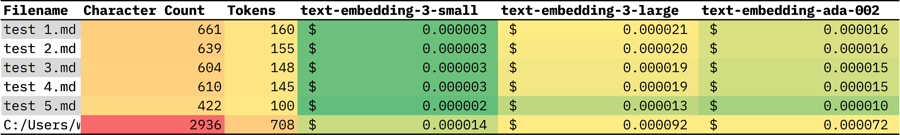

# Logseq Markdown Tokenizer

This project provides a user-friendly graphical interface to tokenize Markdown files within a selected directory, calculate character counts, and estimate the cost of using specific OpenAI models based on the token count. It is designed specifically for Logseq's pages and journals folders, but can tokenize any folder of markdown files.


## Table of Contents

- [Languages Used](#languages-used)
- [Technologies Used](#technologies-used)
- [Installation](#installation)
- [Usage](#usage)
- [Features](#features)
- [Roadmap](#roadmap)
- [License](#license)

## Languages Used

- Python

## Technologies Used

- PySide6 for GUI
- tiktoken for tokenization

## Prerequisites

- Python
- PySide6
- tiktoken library

## Installation

1. Clone the repository:

   ```bash
   git clone https://github.com/yourusername/logseq-markdown-tokenizer.git
   ```

2. Navigate to the cloned directory:

   ```bash
   cd logseq-markdown-tokenizer
   ```

3. Install the required Python packages:

   ```bash
   pip install -r requirements.txt
   ```

## Usage

1. Run the application:

   ```bash
   python main.py
   ```

2. Click on 'Select Folder to Tokenize' to choose the directory containing Markdown files.
3. Enter the desired name for the output CSV file.
4. Click 'Start' to begin the tokenization process.
5. Check the generated CSV file for results.

## Features

- GUI for easy interaction
- Tokenization of Markdown files
- Calculation of character count
- Estimation of cost for using OpenAI models
- Output results to a CSV file



## Roadmap

- Support for additional file formats
- Integration with more OpenAI models/use cases beyond text embeddings
- Enhanced data visualization in the GUI
- Pre-processing content for stopwords before encoding

## License

[MIT License](LICENSE)
